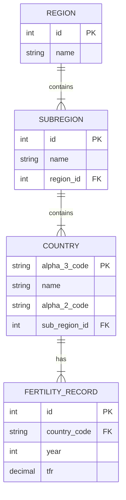

# TFR Analysis Web Application

A three-tier web application for analyzing Total Fertility Rate (TFR) data across countries and regions worldwide.

## 📊 Project Overview

This application provides comprehensive tools for analyzing Total Fertility Rate data, enabling users to:
- View historical TFR trends by country
- Compare fertility rates across regions and sub-regions
- Search and analyze country-specific data
- Perform CRUD operations on TFR records

## 🗄️ Database Design (ER Model)

The database follows the Third Normal Form (3NF) with 4 entities:



## 🚀 Quick Start

### Prerequisites
- Docker and Docker Compose installed
- Git installed

### Installation & Running

1. Clone the repository:
```bash
git clone https://github.com/JinkeSF/Software-Engineering-Final-Exam.git
cd Software-Engineering-Final-Exam
```

2. Start the application:
```bash
docker compose up
```

3. Access the application:
Open your browser and navigate to `http://localhost:3000`

## 🎯 Features

### 1. Country TFR History
Select a country to view its Total Fertility Rate history over the years, ordered chronologically.

### 2. Sub-region Snapshot
Select a sub-region and year to view all countries in that sub-region with their TFRs, ordered by TFR (descending).

### 3. Region Max TFR
Select a region and year to display all its sub-regions with their maximum TFRs, ordered by both region and maximum TFR (descending).

### 4. Keyword Search (2020 Data)
Search for countries by name (partial match) and view their TFRs in 2020, ordered by country name.

### 5. Add Next Year Record
Select a country to add a new TFR record for the subsequent year (e.g., if the latest TFR is in 2023, the new record will be for 2024).

### 6. Update Record
Select a country and year to update the TFR record for that specific entry.

### 7. Delete Range
Delete TFR records for a country within a specific year range.

### 8. Top 10 Lowest TFR (Custom Feature)
View the top 10 countries with the lowest fertility rates in a specific year, highlighting demographic trends.

## 🛠️ Technology Stack

- **Frontend**: HTML5, CSS3, HTMX
- **Backend**: Node.js, Express.js
- **Database**: SQLite3
- **Containerization**: Docker, Docker Compose
- **CSS Framework**: Pico CSS

## 📁 Project Structure

```
Software-Engineering-Final-Exam/
├── public/
│   ├── index.html          # Homepage
│   ├── feature1.html       # Country TFR History
│   ├── feature2.html       # Sub-region Snapshot
│   ├── feature3.html       # Region Max TFR
│   ├── feature4.html       # Keyword Search
│   ├── feature5.html       # Add Next Year Record
│   ├── feature6.html       # Update Record
│   ├── feature7.html       # Delete Range
│   ├── feature8.html       # Top 10 Lowest TFR
│   └── styles.css          # Global styles
├── server.js               # Express server & API endpoints
├── init_db.js              # Database initialization script
├── ETL.sql                 # SQL statements for ETL process
├── compose.yaml            # Docker Compose configuration
├── Dockerfile              # Docker image definition
├── package.json            # Node.js dependencies
├── data1.csv               # TFR data source
├── data2.csv               # Country/region data source
└── README.md               # This file
```

## 📝 Database Normalization

The database design follows the Third Normal Form (3NF):

**1NF (First Normal Form):**
- All tables have primary keys
- All attributes contain atomic values
- No repeating groups

**2NF (Second Normal Form):**
- Meets 1NF requirements
- All non-key attributes are fully dependent on the primary key
- No partial dependencies

**3NF (Third Normal Form):**
- Meets 2NF requirements
- No transitive dependencies
- Region → SubRegion → Country → FertilityRecord hierarchy eliminates redundancy

## 🔄 ETL Process

The ETL (Extract, Transform, Load) process is documented in `ETL.sql`:

1. **Extract**: Load raw data from CSV files into staging tables
2. **Transform**: Clean and normalize data, removing errors and duplicates
3. **Load**: Insert transformed data into normalized tables

## 📄 License

This project is created for educational purposes as part of a Software Engineering final exam.

## 👤 Author

**GitHub**: [JinkeSF](https://github.com/JinkeSF)
